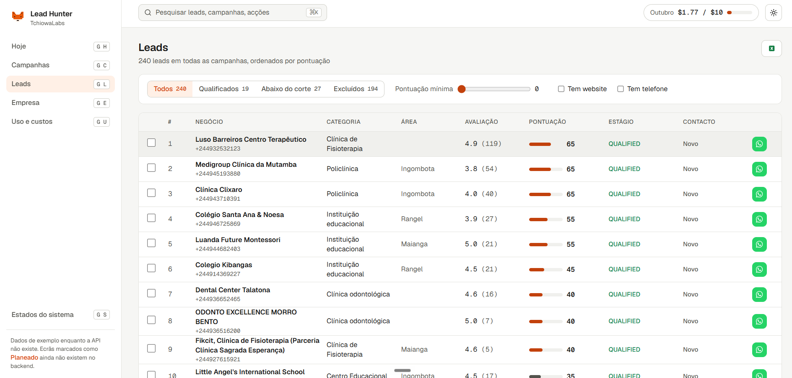

<h1 align="center">Lead Hunter</h1>

<p align="center">
  Find small companies on Google Maps that need software, and get them ranked for WhatsApp or phone outreach.
</p>

<p align="center">
  <a href="https://github.com/idarciooliveira/lead-hunter/actions/workflows/ci.yml"></a>
  
  
  
  
</p>



Lead Hunter is an internal tool for a software factory in Luanda that sells websites, apps and systems to PMEs. It scrapes Google Maps through Apify, drops the places you would never sell to, scores the rest with rules you can read, and writes one WhatsApp pitch per qualified lead. Every point in a score comes with its reason.

It is built for one team and one market, so it is opinionated. The reasons behind each choice are in [docs/adr](docs/adr/README.md).

## Contents

- [What you get](#what-you-get)
- [Quick start](#quick-start)
- [How it works](#how-it-works)
- [Commands](#commands)
- [Web client](#web-client)
- [Configuration](#configuration)
- [Costs](#costs)
- [Deploying on Railway](#deploying-on-railway)
- [Development](#development)
- [Project layout](#project-layout)
- [Contributing](#contributing)

## What you get

- **A ranked list, not a dump.** Hard filters remove closed places, banks, government, big chains and your current clients. Rules score the rest and the top 40% (configurable per campaign) become `QUALIFIED`.
- **Scores you can audit.** Weights live in `Stage1Scorer` and are documented in [ADR 0007](docs/adr/0007-rule-based-scoring.md). The LLM reads reviews and writes pitches. It never sets a score.
- **One pitch per lead.** Written at enrichment, and dropped if it quotes a number the data does not have.
- **A hard budget.** $10 a month by default. `--dry-run` shows the estimated cost, and `usage` shows what each run and LLM call actually cost.
- **CLI and web.** Run campaigns from the terminal, work the daily queue in the browser.

## Quick start

You need Docker and a JDK 21. For the full list of tools per workflow, see [Development](#development).

```bash
git clone https://github.com/idarciooliveira/lead-hunter.git
cd lead-hunter
cp .env.example .env            # set APIFY_TOKEN and AI_GATEWAY_API_KEY
docker compose up -d postgres   # Postgres on localhost:5432

./lh company setup              # once: your company, services, clients, cases
./lh campaign new               # answer the campaign questions
./lh campaign run clinicas-luanda --dry-run   # estimate the cost first
./lh campaign run clinicas-luanda
./lh campaign enrich clinicas-luanda
./lh leads today                # who to contact today
```

`./lh` builds the jar the first time and then runs it. No Java? Use the [Docker option](#option-b-everything-in-docker) instead. Want to see the web client without any keys? Run `cd web && pnpm install && pnpm dev` and it opens on sample data.

## Status

| Step | What | State |

| Step | What | State |
|---|---|---|
| 1 | Scaffold, schema, campaigns from YAML | done |
| 2 | Apify scraping, stage 1 filters, scoring and cut | done |
| 3 | Website crawl and stage 2 scoring | done |
| 4 | Review analysis and pitches through the Vercel AI Gateway | done |
| 5 | `today` queue, `lead mark` outcomes, CSV export | done |
| 6 | Calibration on existing clients | first pass done, see [docs/calibration.md](docs/calibration.md); seed clients cannot be scored, see the note |

## How it works

1. The company profile says what you sell, at what price, to whom you've sold, and what you can prove. You answer it once with `company setup`, see [ADR 0019](docs/adr/0019-company-profile.md).
2. A campaign answers 11 questions about its goal: sector, the problem you bet on, the service you pitch, which Maps signals qualify or rule out a place, and the goal with a stop rule. Then it lists search terms and locations. Create it with `campaign new`, or write the YAML yourself.
3. `campaign run` starts one Apify Google Maps run per location, with no reviews or images to keep it cheap.
4. Each place gets hard filters first: closed, no phone, your current clients (by phone, then name), banks, government, telecoms, big chains, fewer reviews than the campaign minimum, and the campaign's disqualifying signals.
5. The rest get a stage 1 score from rules in `Stage1Scorer`. Every point comes with a reason.
6. The top share of the campaign, 40% by default, becomes `QUALIFIED`. The rest is `BELOW_CUT`, with the reason stored.
7. `campaign enrich` crawls each qualified lead's website, fetches its recent reviews, classifies what customers complain about, and adds the stage 2 points to the score. It then writes one WhatsApp pitch per lead, and drops any pitch that quotes a number the data does not have. See [ADR 0027](docs/adr/0027-stage-two-website-crawl.md) and [ADR 0040](docs/adr/0040-one-pitch-per-lead-written-at-enrichment.md).

Places are shared across campaigns and deduplicated by Google place ID. Re-running a campaign never touches a lead you already worked on.

## Run it locally

Quick start above is the short path. This section covers both ways to run the CLI. First time, in the project root:

```bash
cp .env.example .env          # then replace APIFY_TOKEN and AI_GATEWAY_API_KEY
docker compose up -d postgres # Postgres on localhost:5432, data kept in a Docker volume
```

There are two ways to run commands. Both use the same database, so you can mix them.

### Option A: Java on your machine

Needs a JDK 21 (a JRE is not enough to build; `.sdkmanrc` pins it for SDKMAN, so `sdk env install` sets it up; then `sdk env` in each new shell, or enable `sdkman_auto_env=true` in `sdk config`). `./lh` finds the pinned JDK on its own, but `mvnw` needs `sdk env` or `JAVA_HOME`. Line endings are pinned by `.gitattributes`, so `./lh` and `backend/mvnw` stay LF even with `core.autocrlf=true`. `./lh` builds the jar the first time, then runs it.

```bash
./lh                                                # no arguments in a terminal: the interactive menu
./lh --help
./lh company setup                                  # once: your company, services, clients, cases
./lh campaign new                                   # answer the campaign questions, no file needed
./lh campaign create -f my-campaign.yml            # or load a file (see `campaign template`)
./lh campaign run clinicas-luanda --dry-run
./lh campaign run clinicas-luanda
./lh campaign enrich clinicas-luanda --dry-run
./lh campaign enrich clinicas-luanda
./lh leads list clinicas-luanda
./lh leads show 12
./lh usage
./lh llm test
```

After changing code, rebuild with `./backend/mvnw -f backend/pom.xml package -DskipTests`. `./lh` only builds when the jar is missing. On Windows, use `backend\mvnw.cmd -f backend\pom.xml package -DskipTests` and then `java -jar backend\target\lead-hunter.jar <command>`.

### Option B: everything in Docker

Needs only Docker. The first run builds the image, which takes a few minutes.

```bash
docker compose run --rm app                          # the interactive menu
docker compose run --rm app --help
docker compose run --rm app company setup
docker compose run --rm app campaign new
docker compose run --rm app campaign create -f campaigns/my-campaign.yml
docker compose run --rm app campaign run clinicas-luanda
docker compose run --rm app leads list clinicas-luanda
```

The `app` service reads `.env`, connects to the `postgres` service by name, and mounts `./campaigns` into the container, so YAML files you put there (for `campaign create -f` and `company update -f`) are visible inside. The database holds the campaigns and the company profile; these files are only a way to load them. After changing code, rebuild with `docker compose build app`.

A shorter alias: `alias lhd='docker compose run --rm app'`, then `lhd leads list clinicas-luanda`.

## Commands

| Command | What it does |
|---|---|
| `menu` | Numbered menu to run a campaign, browse leads, create a campaign, see the company profile, usage, users and organizations. Opens by itself when you run with no arguments in a terminal. Greets you with a shaded fox illustration (monochrome text without color; honor `NO_COLOR`) |
| `company setup` | Ask the company questions and save the profile. Run it again to change answers |
| `company update -f <file>` | Save the profile from a YAML file |
| `company show` | Print the saved profile |
| `company template` | Print an example company file |
| `campaign new` | Ask the campaign questions and save the campaign. Needs a company profile |
| `campaign template` | Print an example campaign file |
| `campaign create -f <file>` | Save a campaign. Same slug again updates it. The service must be one the company sells |
| `campaign list` | Campaigns and how much each has spent on Apify |
| `campaign run <slug> [--dry-run] [--allow-over-limit]` | Scrape, filter, score, cut |
| `campaign enrich <slug> [--dry-run] [--batch-size 25] [--max-reviews 10]` | Crawl websites, fetch reviews, classify complaints, rescore the qualified leads and write their pitches |
| `leads list <slug> [--stage QUALIFIED\|BELOW_CUT\|EXCLUDED\|ALL] [--limit 20]` | Ranked leads |
| `leads today [--limit N]` | Today's queue: qualified leads nobody has contacted, best first. Default size is the weekly capacity over five days |
| `leads export <slug> [--stage ...] [--out file.csv]` | Write the leads as a CSV file that Excel opens |
| `leads show <id>` | Lead card with score breakdown, pitch and WhatsApp link |
| `leads pitch <id>` | Write a new pitch for a lead, replacing the old one. Spends LLM credit |
| `leads mark <id> --status <status> [--lost-reason <reason>] [--note <text>]` | Mark a contact outcome. `LOST` needs one of `NO_BUDGET`, `WRONG_PERSON`, `HAS_SUPPLIER`, `NOT_INTERESTED`, `NOT_NOW` |
| `usage [--month YYYY-MM] [--campaign <slug>] [--runs] [--limit 30]` | What Apify and the LLM have cost, with a monthly budget bar and spend per campaign. `--runs` lists each run and call |
| `users add <email> --name <name> [--org <slug>] [--role owner\|admin\|member]` | Create an account for the web app. Asks for the password twice without showing it, and writes it the way Better Auth reads it (ADR 0042) |
| `users list`, `users password <email>`, `users remove <email> [--yes]` | List accounts with their organizations, set a new password (it ends their sessions), delete an account |
| `orgs add <name> [--slug <slug>]`, `orgs list` | Create and list organizations, the tenants (ADR 0043) |
| `members add <org> <email> [--role owner\|admin\|member]` | Add a user to an organization, or change their role |
| `llm test ["prompt"]` | Send one prompt to the configured model, print the answer, token usage and cost |

## Web client

The browser version lives in `web/` (ADR 0030). It has every screen from the prototype and reads the HTTP API through server functions when `LEADHUNTER_API_URL` is set on the web server, or sample data without it (ADR 0031, 0035, 0037). See [web/README.md](web/README.md) to run it, and [docs/screenshots/web](docs/screenshots/web) for what each page looks like.

```bash
cd web && pnpm install && pnpm dev   # http://localhost:3000, on sample data
```

### API and web with one command

Both read `.env` and use the same database as the CLI. Set `LEADHUNTER_API_TOKEN` and `BETTER_AUTH_SECRET` in `.env` for `docker compose up`; `./dev` makes both when they are unset (a made secret lasts one run, so everyone signs in again after a restart). Create an account first with `./lh orgs add` and `./lh users add` (ADR 0042), then sign in at `/entrar`. See [ADR 0039](docs/adr/0039-full-stack-in-docker-compose-and-a-dev-script.md).

```bash
docker compose up --build   # everything in Docker: Postgres, the API on :8080, the web on :3000
./dev                       # Postgres in Docker, the API and `pnpm dev` (hot reload) on your machine
```

`docker compose up` needs only Docker; after changing code, run it again with `--build`. `./dev` needs JDK 21, Node 22+ and pnpm, rebuilds the jar each time it starts, and Ctrl+C stops the API and the web server. Both use ports 5432, 8080 and 3000, so run one at a time.

## Configuration

Copy [.env.example](.env.example) to `.env` in the project root and replace the values. The app reads `.env` on startup from the directory you run it in, so there's nothing to export. Real environment variables override `.env`, which is how Railway's settings take over in production. `.env` is in `.gitignore`. New knobs are added to `.env.example` over time, so after pulling, re-copy or merge from `.env.example` into your `.env`.

| Variable | Default | Notes |
|---|---|---|
| `APIFY_TOKEN` | none | Required for `campaign run`. From console.apify.com, Settings, API & Integrations |
| `AI_GATEWAY_API_KEY` | none | Vercel AI Gateway key. Check it with `llm test` |
| `LEADHUNTER_LLM_MODEL` | `google/gemma-4-26b-a4b-it` | Any gateway model id. Gemma is for testing, see [ADR 0017](docs/adr/0017-vercel-ai-gateway.md) |
| `LEADHUNTER_LLM_BASE_URL` | `https://ai-gateway.vercel.sh/v1` | Any OpenAI-compatible endpoint |
| `PGHOST`, `PGPORT`, `PGDATABASE`, `PGUSER`, `PGPASSWORD` | docker-compose values | Railway sets these on its Postgres |
| `LEADHUNTER_API_TOKEN` | none | Service token the web server sends and the API requires on every `/api` call. The web profile will not start without it. `openssl rand -hex 32` makes one |
| `BETTER_AUTH_SECRET` | none | Signs the web session cookies. Needed by the web server whenever `LEADHUNTER_API_URL` is set. `openssl rand -hex 32` makes one |
| `BETTER_AUTH_URL` | none | The address the web app is opened on, for example `http://localhost:3000` |
| `DATABASE_URL` | docker-compose value under `./dev` | Postgres connection string the web server keeps its sessions in. It is the same database as the API |
| `LEADHUNTER_APIFY_MAX_PLACES_PER_RUN` | 600 | Budget guard. Larger runs need `--allow-over-limit` |
| `LEADHUNTER_APIFY_ESTIMATED_USD_PER_PLACE` | 0.004 | Only for `--dry-run`. Set it from the actor's pricing page |
| `LEADHUNTER_USAGE_MONTHLY_BUDGET_USD` | 10 | The budget the bar in `usage` measures against |
| `LEADHUNTER_STAGE2_BATCH` | 25 | Qualified leads enriched per `campaign enrich` run |
| `LEADHUNTER_STAGE2_MAX_REVIEWS` | 10 | Recent reviews fetched per place for the complaint classification |

## Costs

The budget is $10 a month for scraping and LLM calls, see [ADR 0006](docs/adr/0006-two-stage-pipeline.md). Every Apify run stores what Apify reported it cost in `campaign_run.cost_usd`, failed and aborted runs included, and every LLM call stores the cost the gateway reported in `llm_call.cost_usd`. `usage` adds it up, see [ADR 0021](docs/adr/0021-track-usage-and-costs.md). LLM history starts from the day `usage` shipped. Always `--dry-run` a new campaign first.

## Deploying on Railway

Create a Railway project with a Postgres database and a service built from the `Dockerfile`. The image's default command prints help and exits, so either:

- run the CLI from your laptop against Railway's database: `railway run java -jar backend/target/lead-hunter.jar leads list clinicas-luanda`, or
- set the service's start command to a campaign run and give it a cron schedule, with restart policy "Never".

## Development

| Tool | Needed for |
|---|---|
| Docker | Postgres, integration tests, the all-in-Docker option |
| JDK 21 | Building and running the backend without Docker. A JRE is not enough |
| Node 22+ and pnpm | The web client. Run `corepack enable` once |

Run the full check before you open a pull request. It is the definition of done here:

```bash
./check            # backend build and tests, then web lint, typecheck, tests, build and Playwright smoke tests
./check backend    # one half only
./check web
```

To run only the backend tests:

```bash
(cd backend && ./mvnw test)
```

Integration tests need Postgres. They use Testcontainers when Docker is running. Without Docker, point them at an empty database:

```bash
(cd backend && LEADHUNTER_TEST_JDBC_URL=jdbc:postgresql://localhost:5432/leadhunter_test ./mvnw test)
```

No test calls a real external API. See [ADR 0016](docs/adr/0016-testing-strategy.md) and [ADR 0034](docs/adr/0034-check-script-and-ci-define-done.md).

## Project layout

```
backend/    Spring Boot app and picocli CLI, package me.iofdev.leadhunter
            (company, campaign, maps, apify, place, scoring, pipeline, llm, usage, auth, api, cli, input)
web/        TanStack Start client, one folder per feature under src/features
docs/       adr/ decisions, api.md, calibration.md, screenshots/
evals/      harness and rounds for evaluating the LLM steps
campaigns/  YAML files you load with `campaign create -f` (created by you)
```

## Contributing

Read [docs/adr/README.md](docs/adr/README.md) before you change architecture, libraries, data sources, scoring or scope. A change that makes one of those choices needs a new ADR in the same pull request. Never rewrite an accepted ADR. Write a new one and mark the old one superseded.

- Commits and pull request titles use Conventional Commits, for example `feat(usage): add the usage command`.
- Keep pull requests small, and run `./check` first.
- Before you add a Flyway migration or an ADR, check the next free number on `main` and in open pull requests.
- Agent and conventions notes are in [CLAUDE.md](CLAUDE.md) and [AGENTS.md](AGENTS.md).

## License

No license file has been added yet, so all rights are reserved by default. Open an issue if you want to reuse the code.
